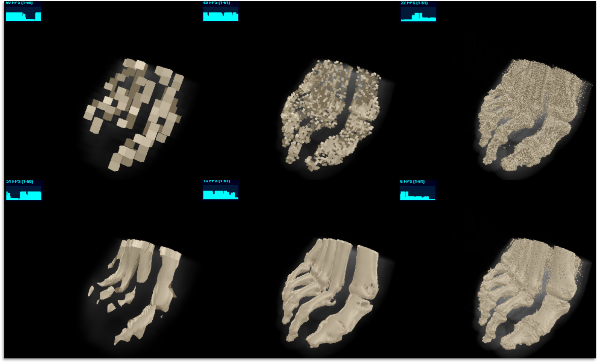

## Description

Ce projet consiste à visualiser en temps réel, dans un canevas HTML, des matrices de données,
appelé Datacube, issues de l’observation terrestre.

Le programme est développé en JavaScript et utilise l’API graphique WebGL.
Le rendu de ces Datacube est réalisé grâce un algorithme de Raycasting amélioré.
Les dimensions de Datacube supportées sont 163, 643, 2563 et 10243.

Le programme dispose de trois modes de rendu de volume :

* Un premier rendu, appelé X-Ray pour les Datacube XYZ.
* Un deuxième rendu simulant les surfaces implicite pour les Datacube XYZ.
* Un troisième rendu, appelé Dérivé, pour les Datacube XY avec une dimension de temps.

Tous les algorithmes sont intégrés dans un notebook Jupyter.

## Images





## Vidéos


## Liens