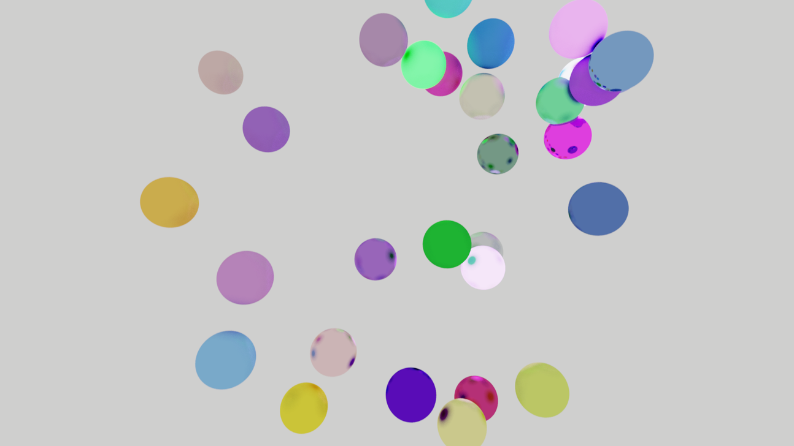

Moteur de génération d’image en utilisant l’algorithme ray marching et la détection d'objets par fonction de distance signée (SDF).
Le moteur de rendu réalisé en C++ prend en charge : 
* La gestion de matériaux différents
* Le rebond de rayons
* Le Multisampling
* Le rendu de l'interface utilisateur 



